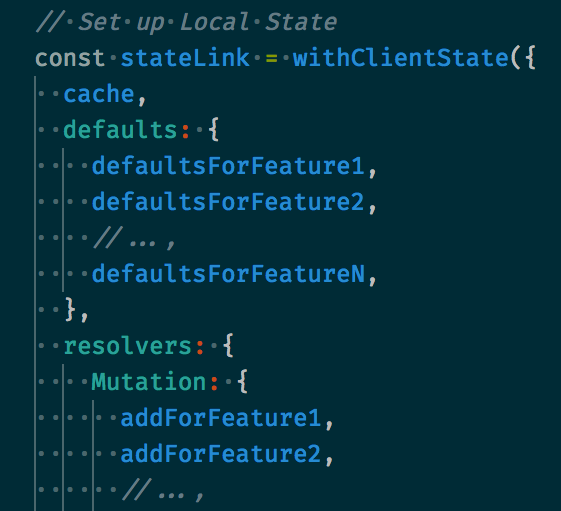

I want to touch on how to set up `apollo-link-state` to allow for support of multiple stores without interfering with one another.

In my last post we went over how to setup `apollo-link-state` for basic use:

[**Storing Local State in React with apollo-link-state**  
_Special thanks to Peggy Rayzis for all the awesome work and communication that has been going out around this product._medium.com](https://medium.com/@bnchrch/storing-local-state-in-react-with-apollo-link-state-738f6ca45569 "https://medium.com/@bnchrch/storing-local-state-in-react-with-apollo-link-state-738f6ca45569")

Now in this tutorial this is the moon we’re shooting for:

1.  Moving `withClientState` to its own file.
2.  Moving specific resolvers and mutations to their own files.
3.  Writting an elegant way to merge together multiple stores.
4.  Adding a new Notes feature to the previous demo.

Lets Dive in! 🚀🌙

### My biggest problem when using `apollo-link-state`

To kick this off I want to talk about the problem we are trying to solve.

It boils down to that `CreateClientState` expects only one value for `defaults` and one value for `Mutations.resolvers` which is incompatible if you have more than 1 object you want to store.

It’s incompatible because it forces us to keep the `resolvers` and `defaults` for multiple logically separate features in one place. OR if forces us to explicitly reference a `resolver`/`default` from a separate file every time we create one.

This is bad and in a medium to large app is a great way to make your logic hard to track.

### How can we solve this

Thankfully the solution to this is really easy! It involves the following:

#### 1\. Move `CreateClientStore out of` our `client.js file`

Move the configuration of your client store to its own file to help highlight that this is a very specific and a very important piece in our application.

Our new `client.js` should look like this:

Embed placeholder 0.9967662286113295

#### 2\. Move our defaults, resolvers, and `@client` queries to their own file

Break out the `defaults` and `resolvers` for a specific area of functionality into their own “store” files to help ensure as the application grows code is logically co-located.

Embed placeholder 0.7425668958468103

#### 3\. Tie it together with some lodash magic 🧙‍

Finally we use some helpers from lodash to merge the export of each `store` file into one. This allows us to define `resolvers` and `defaults` in separate files and bring them back together during configuration.

_Look at the_ `_mergeGet_` _function specifically to see how this occurs._

Embed placeholder 0.875958643419742

### Adding another feature becomes easy-peasy

Now that we have the above infrastructure in place adding a second feature is just as easy as adding the 100th feature.

Lets test out this statement by adding a Freeform notes field to the application.

#### 1\. Create the Notes Store

Nearly identical to the Todo Store above.

Embed placeholder 0.13370423822931898

#### 2\. Hook up the new Store

Import the new store into `CreateClientStore.js` and add it to our `STORES`.

Embed placeholder 0.6670729017557311

#### 3\. Create the Note Component

Now that we have the store created and wired in it’s time to put it all to use.

Embed placeholder 0.799471980400819

#### 4\. Add to app.js

Finally add our new component to our `<App/>` container.

Embed placeholder 0.8429828798815102

### See it in action!

You should now be able to run the update demo and see our new note’s feature in action. Simple.

### Wrap up

I wanted to put this out because I think this Apollo’s version of maintaining local state has some real potential and as a young project the more support it gets the more we should see if grow and thrive.

Part of supporting a project is learning how to use it and learning how to improve on it. I hope this helps do both!

Happy coding!

> 🧞‍ This is open source! you can [find it here on Github](https://github.com/bechurch/link_state_demo)

> ❤️ **I only write about programming and remote work. If you** [**follow me on Twitter**](https://www.twitter.com/bnchrch) **I won’t waste your time.**