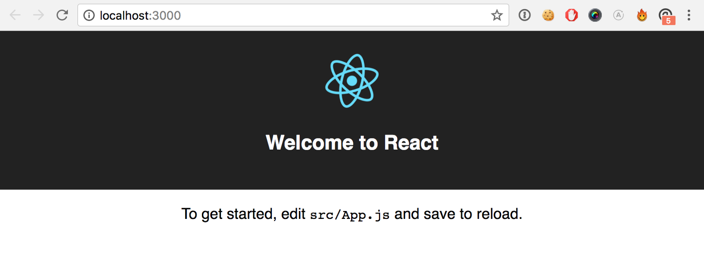

[**GraphQL**](https://graphql-docs.com/) and its ecosystem are awesome and [**Apollo**](https://github.com/apollographql) makes using it a pleasure. If you are writing a javascript application today I can’t stress enough how much simpler these two technologies will make that process.

A**pollo** has recently **moved away from** [**Redux**](https://redux.js.org/) and released there own mechanism to help you store local state in their cache. I’m really excited about this move and believe that this will further simplify the process of frontend development. However it does add complexity in the fact that there not many resources or third party library support out there for **apollo-link-state** yet. This tutorial aims to help change that. 😀

By the end of this tutorial you will have:

1.  Setup a React project using `create-react-app`
2.  Used `apollo-link-state` to store and query for information
3.  Written some stateless components with help from `recompose`

> _Special thanks to_ [_Peggy Rayzis_](https://medium.com/@peggyrayzis) _and the_ [_Apollo team_](https://twitter.com/apollographql) _for all the awesome work and communication that has been going out around this product._

> _See her_ [_Future of State Management_](https://dev-blog.apollodata.com/the-future-of-state-management-dd410864cae2)  _post to see what initially brought we over to this technology_

### Getting Setup

#### Before you start

Please make sure you have the following installed and/or ready to go:

1.  Node
2.  Npm
3.  [Yarn](https://yarnpkg.com/en/)

#### Initialize the project

First before we can dive into Apollo we need a React App to use it with so lets create a React project called `link_state_demo` using `create-react-app`.

```
# Download Create React App
yarn global add create-react-app

# Use it to create a React Project
create-react-app link_state_demo

# Navigate to the project
cd link_state_demo
```

#### Add Additional Dependencies

Next we want to add `apollo`, `apollo-link-state`, `recompose` and `lodash` among other supporting libraries.

```
yarn add apollo-boost apollo-client-preset apollo-link-state react-apollo graphql-tag graphql lodash recompose
```

#### Kick it off!

It’s that simple, now we can just start our dev server and go!

```
yarn start
```

_You should now be able to navigate to_ `_localhost:3000_` _and see your application running._



### Modify App.js to be Stateless

**_Optional!_**

I prefer to write my components using React’s stateless components because I **believe** It helps to simplify my code by:

1.  Reducing boilerplate
2.  Increasing Readability
3.  Discouraging lifecycle methods
4.  Encouraging a healthy separation between UI and Application Logic

_Though these are opinions and not required for using this demo!_

To change over to using stateless components is as easy as copying the code below to your `app.js` file:

Embed placeholder 0.1405277058126988

### Setup the Apollo Client

To begin we will have to set up our Apollo client. This is fairly simple and will involve the modification of one existing file and the creation on another.

#### Setup the ApolloProvider

Open `index.js` and wrap `<App/>` in Apollo’s `ApolloProvider`.

Embed placeholder 0.9829136098137738

#### Setup the ApolloClient

Create a new file named `Client.js` and initialize the cache and the `ApolloClient`

Embed placeholder 0.6480453154390855

### Setup State logic that will support a To-Do List

**_(A To-Do List Demo! How Original!)_**

Now that we have the Apollo Client setup it’s time to begin adding the methods, queries and components that will allow us store and modify local state in the Apollo Cache.

#### Add apollo-link-state to Client.js

Below you’ll find an updated `Client.js` which fully implements all the necessary tools to use `apollo-link-state` to handle Todo list state. However before you dive into it you should understand what the sections do:

**Defaults**

The default values that our local cache falls back to when the application loads.

**GraphQL**

This section houses the GraphQL queries which are used in the following ways:

1.  Finding data from the cache
2.  Finding where to insert data into the cache

There are a few differences to pay attention to:

**_The_** `**_@client_**` **_decorator_**

This is what tells Apollo that these queries target the local cache.

**_Query vs Mutation_**

The `query` keyword in the `@client` context does exactly what you expect, it looks for the data in the cache and returns it.

However the `mutation` keyword tells us that it needs to modify something in the cache. To do this the mutation looks for an identically named function in the resolvers object we pass into `CreateClientStore` which we define further down.

**Cache Mutations**

These are the functions that are called by our mutation queries. They are given the parameters sent to the query and an instance of the cache with the intention that we use these to update the state held inside.

**Store**

This is where we tie together our cache, client state, defaults, resolvers and the Apollo Client to give the ApolloProvider the ability to store state using `apollo-link-state`.

**Helpers**

Here we’ve created a Higher Order Component to help give a child component access to the functions needed to interact with the state mechanism we’ve just setup.

**What this all looks like**

Embed placeholder 0.17700122416606834

### Setup the TodoList Component

Next we need to actually use the queries we defined above. To do this we are going to create a basic To Do List that lets us add items to a list and clear the list.

#### Create TodoList.js

Embed placeholder 0.20677876332435807

#### **Add TodoList to our App**

We then just need to add the `TodoList` to our `App` container and it should be good to go.

Embed placeholder 0.3232088284926202

#### What it should look like

Navigating back to `localhost:3000` you should see:


And thats it! You’re now storing state locally using `apollo-link-state`


### Wrap up

Simple solutions and simple architectures lead to a better and more stable systems in the long run. While GraphQL has helped to simplify query logic the Apollo Team has been doing an equal amount of work to simplify the rest. Because of this I’m happy to include these two technologies where ever I can.

In this specific case `apollo-link-state` has proved to be a valid alternative to Redux and has saved me from:

1.  Adding another technology and paradigm
2.  Splitting my state into multiple locations
3.  Adding more that one method to get application state.

The only caveat so far is that Link State lacks some tooling and third party library support that the Redux community enjoys, but I believe that is a very small and very temporary issue.

### Coming up next

We dive into how to set up `apollo-link-state` for success when handling `N`additional stores.

[**Setting up apollo-link-state for Multiple Stores**  
_Overview_medium.com](https://medium.com/@bnchrch/setting-up-apollo-link-state-for-multiple-stores-4cf54fdb1e00 "https://medium.com/@bnchrch/setting-up-apollo-link-state-for-multiple-stores-4cf54fdb1e00")[](https://medium.com/@bnchrch/setting-up-apollo-link-state-for-multiple-stores-4cf54fdb1e00)

> **_🧞‍_ This is open source! you can** [**find it here on Github**](https://github.com/bechurch/link_state_demo)

> ❤️ I only write about programming and remote work. If you [follow me on Twitter](https://www.twitter.com/bnchrch) I won’t waste your time.